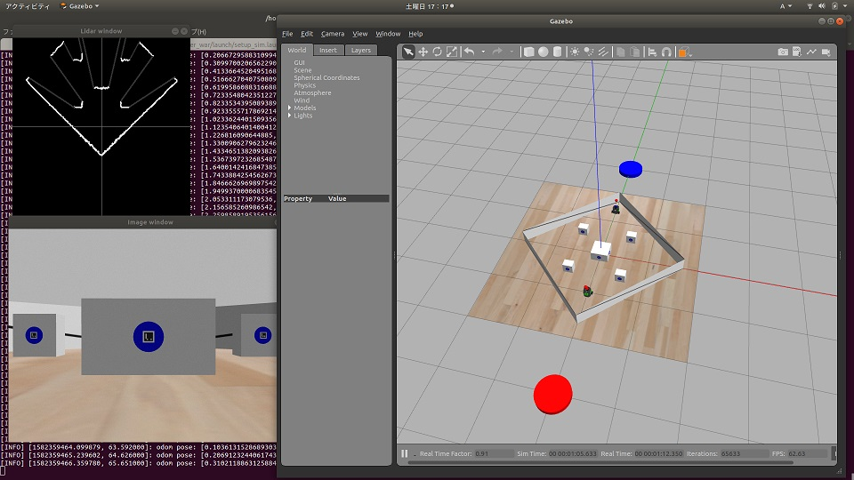

# ros wiki

## try move w/ Lidar

審判動かないんで、とりあえず動かしただけ
https://github.com/naruai/burger_war/blob/master/burger_war/launch/your_burger.launch
https://github.com/naruai/burger_war/blob/master/burger_war/scripts/red_robo.py

## try Lidar

Lidarのrangesの距離情報を可視化（左上の線画）

~~~
    # lidar scan topic call back sample
    # update lidar scan state
    def lidarCallback(self, data):
        self.scan = data
        #rospy.loginfo(self.scan)
        self.limg=np.zeros((400,400), np.float)
        cv2.line(self.limg,(200,0),(200,400),0.5,1)
        cv2.line(self.limg,(0,200),(400,200),0.5,1)
        ranges=self.scan.ranges
        p0=[ 200.0, 200-ranges[0]*200/2.0 ]
        for it in range(360):
            t=-math.pi*(it+90)/180.0
            r=ranges[it]*200.0/2.0
            p1=[ 200+r*math.cos(t), 200+r*math.sin(t) ]
            if dist2d(p0,p1)<20:
                cv2.line(self.limg,(int(p0[0]),int(p0[1])),(int(p1[0]),int(p1[1])),1.0,2)
            else:
                cv2.line(self.limg,(int(p0[0]),int(p0[1])),(int(p1[0]),int(p1[1])),0.2,2)
            p0=p1
        cv2.imshow("Lidar window", self.limg)
        cv2.waitKey(1)
~~~

## try melodic --ubuntu18--

  - [ubuntu1804ros](https://symfoware.blog.fc2.com/blog-entry-2265.html)

ubuntu 18.04 で ros ; 英語ページにはmelodicの情報あった
aruco-rosはaptで取ってこれずgithubから落としてmakeしたけど、docker内のubuntu16.04からros動かすより楽？

  - kinetic/ubuntu16.04 -> melodic/ubuntu18.04

  - [wiki.ros.org/melodic/Installation/Ubuntu](http://wiki.ros.org/melodic/Installation/Ubuntu)

status:
  - install ros : ok

  - sudo apt-get install ros-kinetic-aruco-ros ; melodic 見当たらず… git clone - cmake - make した [aruco-roc](https://github.com/pal-robotics/aruco_ros)
    - **まだ問題あり** (審判エラー出て動いてなかった)
      - catkin_make

  - [GiHub OneNightROBOCON/burger_war](https://github.com/OneNightROBOCON/burger_war/blob/master/README.md)
    - catkin_ws/src/burger_war/script/*.sh の gnote-terminnal -e "**python** ... -> **python3** に書き換え

## try docker ubuntu 16.04

**中止。ubuntu18.04で動かす方が、XのDisplay情報なんとかするより早い？...**

docker ubuntu:16.04 使用して、ros 使用。xtermでターミナル複数開いて、gazeboと

status:
  - install ros :インストールは出来てそう 

  - executing...some issues : まだ実行時にエラーが
    - gazebo:  X DISPLAY property mismatch
      - [gazebo で X Error](https://github.com/naruai/wiki/blob/master/ros/errlog_gazebo.txt)
    - launch:  some error
      - [bash scripts/sim_with_judge.sh でもエラー](https://github.com/naruai/wiki/blob/master/ros/errlog_sim_with_judge.txt)

  - execute...log : なんか動いてる？
    - [log_your_burger_random.txt](https://github.com/naruai/wiki/blob/master/ros/log_your_burger_random.txt)

### R-link

  - [Burger Spec](https://github.com/naruai/burger_war/blob/master/doc/burger_spec.pdf)
  
  
### 参考link

  - [GiHub OneNightROBOCON/burger_war](https://github.com/OneNightROBOCON/burger_war/blob/master/README.md)
    - [GiHub gogo5nta/burger_war](https://github.com/gogo5nta/burger_war/blob/master/README.md)
  - [Dockerコンテナの中でGUIアプリケーションを起動させる](https://unskilled.site/docker%E3%82%B3%E3%83%B3%E3%83%86%E3%83%8A%E3%81%AE%E4%B8%AD%E3%81%A7gui%E3%82%A2%E3%83%97%E3%83%AA%E3%82%B1%E3%83%BC%E3%82%B7%E3%83%A7%E3%83%B3%E3%82%92%E8%B5%B7%E5%8B%95%E3%81%95%E3%81%9B%E3%82%8B/)

  - [ubuntu1804ros](https://symfoware.blog.fc2.com/blog-entry-2265.html)
  - [Ubuntu install of ROS Melodic](http://wiki.ros.org/melodic/Installation/Ubuntu)

  - [Amazon ROSロボットプログラミングバイブル](https://www.amazon.co.jp/dp/4274221962/ref=cm_sw_r_cp_ep_dp_lH4KAb6JMS670)

  - [詳説ROSロボットプログラミング](https://github.com/bmagyar/rosbook_jp)

  - [turtlebot_gazeboTutorials](http://wiki.ros.org/turtlebot_gazebo/Tutorials/indigo/Make%20a%20map%20and%20navigate%20with%20it)

### 参考link2

  - [turtlebot3](http://emanual.robotis.com/docs/en/platform/turtlebot3/basic_operation/)
    - [LDS-01](http://emanual.robotis.com/docs/en/platform/turtlebot3/appendix_lds_01/)

  - [Robotics LDS-01](http://www.robotis.us/360-laser-distance-sensor-lds-01-lidar/)

  - 

  - [TurtleBot3で地図作成からナビゲーションまで](https://proc-cpuinfo.fixstars.com/2018/11/turtlebot3-navigation/)

### ref link

  - [ROSでの超基本的なプログラム作成](https://qiita.com/Kohei_Koizumi/items/5c8062ce7f71b9bb6e33)

> r = rospy.Rate(10)
>>これは１秒間に送る送信回数を定めています。
>>今回でいうと１秒間に１０回ということになりますね。

  - [ROS講座31 python基礎](https://qiita.com/srs/items/a0ce380687d9cc896404)

#### 解決策探し中・・・

  - [Qiita DockerのUbuntuにデスクトップ環境を作成](https://qiita.com/FukuharaYohei/items/a6c1e1a2ba8d1285cfa5)
  - [Xサーバ設定ファイルxorg.confを設定する](http://www.ne.jp/asahi/it/life/it/linux/linux_setting/xorg_conf.html)
   
